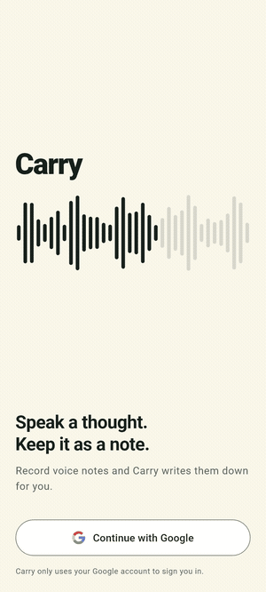

# Carry

**Speak a thought. Keep it as a note.**

Carry is a voice notes app for Android. You tap Record, say what you want to
remember, and it is kept as a note. The point of it is that you read the note
later instead of listening to yourself again — turning the recording into text
is the piece being built now, and [Where it is](#where-it-is) says what works
today.

<p align="center">
  
</p>

## What it does

- **Sign in with Google.** Nothing else is asked for, and the account is only
  used to know whose notes are whose.
- **Record a note.** A bar takes over the bottom of the screen with the time
  running: pause and pick it back up, throw it away mid-thought, or save it.
  Up to an hour in one go.
- **Import audio you already have** — a voice memo, a meeting recording — and
  it is treated exactly like something recorded in the app.
- **Keep an eye on the microphone.** Carry records when you tap Record and
  stops when you save or delete, and the permission can be turned off from
  inside the app.
- **Free and Plus.** Free covers an hour of transcription a month; Plus is
  twenty. Buying goes through Google Play, and what you may do afterwards is
  decided by the server, never by the phone.
- **Stay up under load.** The server refuses a flood before it costs anything:
  per-address limits, a cap on how much work runs at once, and a size limit on
  every request.

## Built with

| | |
|---|---|
| **Flutter** | The app. Android today, iOS next |
| **Firebase Auth** | Google sign-in, and the token every request carries |
| **FastAPI** (Python 3.13) | The server |
| **Neon** (Postgres) | Accounts, plans and what each has used this month |
| **Groq Whisper** | Turning audio into text *(next)* |
| **AWS S3** | Where the audio goes, uploaded straight from the phone *(next)* |
| **RevenueCat** | Subscriptions, with Google Play taking the payment |
| **PostHog** | What people do in the app, and what breaks |
| **GitHub Actions** | Tests, format and analyze on every pull request |

## Plans

| | Free | Plus |
|---|---|---|
| Transcription | 1 hour a month | 20 hours a month |
| Audio kept | 30 days | As long as you keep the plan |

Carry never stops you reaching what you already recorded. A plan only decides
how much new audio it will transcribe.

## Where it is

Working: sign-in, recording, importing, the notes list, permissions, settings,
plans and purchases, and the server behind them — accounts, monthly
allowances, and the store's webhook.

Next: sending audio up to S3, transcribing it with Groq, keeping notes on the
phone so they survive a restart, and iOS.

Tests: 300 in the app, 139 on the server.

## Running it

Both halves need their own setup. Firebase first —
[app/docs/auth.md](app/docs/auth.md) walks through it once for both sides.

```
cd app
flutter run
```

```
cd server
python -m venv .venv
.venv\Scripts\activate
pip install -r requirements-dev.txt
copy .env.example .env      # then fill it in
fastapi dev app/main.py
```

`server/.env.example` lists every setting, which ones are required, and what
happens if one is missing.

## The screenshots

The demo above is generated from the app's own screens:

```
cd app
flutter test tool/capture_screens.dart
```

That writes a PNG per screen to `app/build/screens/`.
