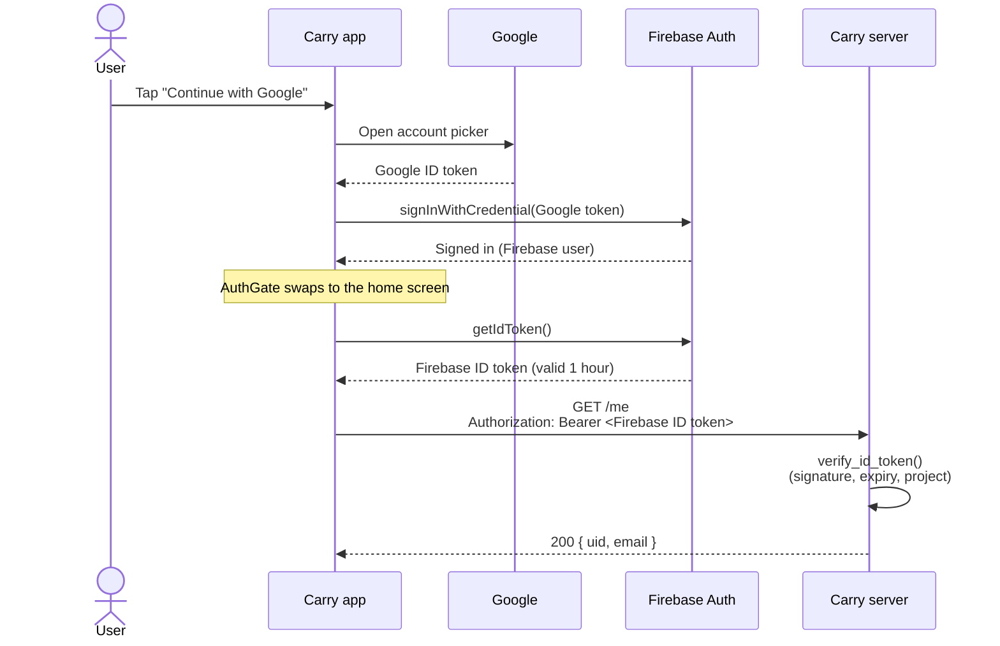

# Carry auth

How people sign in to Carry, and how the server knows who is calling it.

## In one paragraph

Carry uses **Firebase Authentication**. The app signs the user in (Google
today, phone OTP later) with the Firebase SDK. Firebase then hands the app a
short-lived **Firebase ID token**. Every call to the Carry server carries that
token in an `Authorization: Bearer <token>` header. The server checks the
token with the **Firebase Admin SDK** before it does anything. Nobody at
Carry stores passwords, and the server never trusts a user ID the app sends.
It only trusts what's inside a verified token.

## The flow



There are two different tokens in play:

| Token | Who issues it | Who uses it | Sent to our server? |
|---|---|---|---|
| Google ID token | Google | Only the app, once, to sign in to Firebase | **Never** |
| Firebase ID token | Firebase | The app, on every server call | **Yes**, as `Bearer` |

## App side

All auth code lives in the auth feature. The only thing the rest of the app
touches is the `Auth` class (plus the `AuthGate` widget). Screens never call
Firebase or Google directly, and never read Firebase error codes: `Auth` is
the single route in and out. Outside `auth/`, `firebase_auth` is imported only
for the `User` type.

| Call | What it does |
|---|---|
| `Auth.init()` | Sets up Google Sign-In. Runs once in `main()` after `Firebase.initializeApp`. |
| `Auth.signInWithGoogle()` | Opens the account picker and signs in to Firebase with Google's token. Returns `null` if the user closes the picker. Throws on real failures. |
| `Auth.signOut()` | Firebase first (local, instant, flips the app to signed out), then Google (slower, makes the picker show again). Don't reorder: waiting on Google first is what made sign-out feel laggy. |
| `Auth.messageFor(error)` | The sentence to show when a sign-in fails. Screens never read Firebase error codes themselves. |
| `Auth.currentUser` | The signed-in Firebase user, or `null`. |
| `Auth.userChanges` | A stream that fires on sign-in and sign-out. |
| `Auth.idToken({forceRefresh})` | The Firebase ID token for server calls, or `null` when signed out. |

`AuthGate` sits at the root of the app. It listens to `Auth.userChanges`,
shows the sign-in screen when nobody is signed in, and shows the screen
`main.dart` gives it when someone is.

It also **closes anything pushed above it** when the user goes away. Settings
and permissions are pushed routes, and swapping what the gate shows does not
remove them, so without this you sign out and keep staring at Settings. This
covers sign-out from anywhere and a session that ends on its own. Today that's the welcome screen for a
new user and home for everyone else — see [onboarding.md](onboarding.md).

Firebase Auth is also where the user record lives (ID, email, name, photo).
The SDK keeps the session on the device, so people stay signed in between
launches, and Carry keeps no copy of the account.

### Calling the server

**`lib/api/api.dart` is the only place in the app that makes an HTTP call.**
Nothing else imports `http`. Screens and services call a method on `Api`:

```dart
final me = await Api.me();
```

Adding an endpoint means adding one method there, not a client somewhere new:

```dart
static Future<Note> upload(...) async {
  final body = await _send('POST', '/recordings', body: {...});
  return Note.fromJson(body);
}
```

That one place owns, so that no caller has to remember any of it:

| It handles | How |
|---|---|
| The base URL | `--dart-define=CARRY_API=...`, defaulting to `10.0.2.2:8000` for the emulator |
| The token | `Authorization: Bearer <Auth.idToken()>` on every call. Signed out, the call never leaves the phone |
| An expired token | A `401` is retried **once** with `forceRefresh: true`. A second `401` gives up rather than looping |
| Timeouts | 20 seconds for the whole call, body included: headers arriving doesn't mean the body will |
| Errors | Anything not 2xx becomes an `ApiFailure` whose `message` is ready to show |

`ApiFailure.message` prefers the server's own `detail`, because the server
writes those for people ("Too many requests. Try again in 30 seconds."), and
falls back to a sentence per status code. `status` is there for the rare
caller that needs to branch on it.

The Firebase SDK caches the token and refreshes it before the 1-hour expiry,
which is why `Api` asks for it per request and never stores one.

### What the user sees

| Situation | Sign-in screen shows |
|---|---|
| Signing in | A spinner in the button. The button can't be tapped. |
| User closes the Google picker | Nothing. The button is ready again. |
| No internet | "No internet connection. Connect and try again." |
| Anything else (bad config, disabled user, ...) | "Couldn't sign in with Google. Try again." |

The real error is printed with `debugPrint` for developers.
A `clientConfigurationError` in the log almost always means a missing SHA
fingerprint (see setup).

## Server side

On the server, the token check is a dependency and the Firebase call is a
service. A route protects itself by asking for the current user:

```python
from app.dependencies.auth import CurrentUser

@router.get("/notes")
def list_notes(user: CurrentUser):
    uid = user["uid"]   # trusted: comes from the verified token
    ...
```

`CurrentUser` reads the `Bearer` token, verifies it with
`firebase_admin.auth.verify_id_token`, and returns the token's claims:
`uid`, `email`, `name`, and so on. `verify_id_token` checks:
- the signature, against Google's public keys,
- the expiry,
- the issuer and audience (our Firebase project).

| Request | Response |
|---|---|
| Valid token | Endpoint runs with `user` |
| No header, wrong scheme, or empty token | `401` "Sign in required." |
| Expired token | `401` "Session expired. Sign in again." |
| Forged, malformed, or other-project token | `401` "Invalid sign-in token." |
| Google's public keys unreachable | `503` "Can't verify sign-in right now. Try again." |
| The server has no service account key | `503` "Sign-in checks aren't set up on the server." |

Every `401` also sends `WWW-Authenticate: Bearer`.

A missing key is the server's problem, not the caller's, so it answers `503`
and logs what to fix. The server also checks at startup and logs then, rather
than waiting for the first signed-in request to fail.

`GET /me` is the simplest protected endpoint. Use it to check that app and
server agree on who is signed in.

## What comes from Firebase, and where it goes

| Thing | Where you get it | Where it goes | Secret? | Commit? |
|---|---|---|---|---|
| `google-services.json` | `flutterfire configure` (or Firebase console → Android app) | `app/android/app/` | No | Yes |
| `firebase_options.dart` | `flutterfire configure` | `app/lib/` | No | Yes |
| Debug SHA-1 / SHA-256 | `keytool` on your machine (see below) | Firebase console → Project settings → Android app → fingerprints | No | n/a |
| Google sign-in switch | — | Firebase console → Authentication → Sign-in method → Google → Enable | n/a | n/a |
| **Service account key** (JSON) | Firebase console → Project settings → Service accounts → *Generate new private key* | `server/secrets/firebase-service-account.json` | **Yes** | **Never** (git-ignored) |
| `GOOGLE_APPLICATION_CREDENTIALS` | You write it | `server/.env` (copy `.env.example`) | Path only | No (`.env` is git-ignored) |

The app files only identify the project, so they're safe to commit. Firebase
security comes from the rules and the checks above, not from hiding these.
The **service account key is a master key** to the Firebase project. Keep it
out of git, chats and screenshots. If it ever leaks, delete it in the
console and generate a new one.

## Setup, step by step

The app is already connected to the **carry-92aeb** project, with Google
sign-in enabled and this machine's debug fingerprints registered, so steps 1
to 4 are done. They're written down for a new machine or a new project.

**1. Log in to Firebase** (in your own terminal):
```
firebase login --reauth
```

**2. Connect the app** (in `app/`):
```
dart pub global run flutterfire_cli:flutterfire configure --project=carry-92aeb --platforms=android
```
This writes both app config files and adds the Google Services plugin to the
Android build. Everything it generates lives inside `app/`.

**3. Turn on Google sign-in** in the Firebase console, under Authentication →
Sign-in method → Google.

**4. Add your debug fingerprints** in the console. Print them with:
```
keytool -list -v -keystore %USERPROFILE%\.android\debug.keystore -alias androiddebugkey -storepass android
```
Every developer machine has its own debug key, so each one needs adding.
Re-run step 2 afterwards: the fingerprint creates an OAuth client that
`google-services.json` has to pick up. The release key needs adding too before
publishing, or sign-in works in debug and fails in the store build.

**5. Give the server its key** (still to do):
1. Download the service account JSON (see the table above) to
   `server/secrets/firebase-service-account.json`.
2. Copy `server/.env.example` to `server/.env`.

**6. Check it end to end:**
1. Run `flutter run` and sign in.
2. Start the server with `fastapi dev app/main.py`.
3. Call `GET /me` with the app's token. You should get `200` and your email.

## Testing

Neither side's tests use real Firebase or Google.

**App:**
- **Setup:** `setUpTestAuth()` in `setUp` installs a test Firebase Auth and a
  test Google Sign-In. Set `testAuth.google.onAuthenticate` to choose what the
  picker returns or throws. Use `whenCalling(...).on(testAuth.firebase).thenThrow(...)`
  to make a Firebase call fail.
- **What's covered:**
  - sign-in passes Google's token to Firebase,
  - cancel, Google errors and Firebase errors,
  - sign-out,
  - ID token when signed in and signed out,
  - every sign-in screen state,
  - `AuthGate` switching screens,
  - home sign-out.

**Server:**
- **Setup:** tests override the `token_verifier` dependency with a test
  verifier, where each token string picks an outcome.
- **What's covered:**
  - `/health` is open,
  - a valid token,
  - no header, wrong scheme and empty token,
  - invalid token, expired token,
  - Google keys unreachable.

Run them with:
```
cd app && flutter test
cd server && .venv\Scripts\activate && pytest
```

## Known limits

- **Revoked sessions aren't checked.** The server doesn't pass
  `check_revoked=True` (that costs a network call per request). A disabled or
  signed-out-everywhere user keeps access until their token expires, at most
  1 hour. Turn it on for sensitive endpoints if needed.
- **Google only.** Phone OTP is next and will be added as methods on `Auth`.
- **Android only for now.** iOS needs its own Firebase app, a
  `GoogleService-Info.plist`, and `GIDClientID` plus a URL scheme in
  `Info.plist`. See [ios.md](ios.md).
- **No release key yet.** Release builds need their own SHA fingerprints in
  Firebase, and `app/android/app/build.gradle.kts` still signs release builds
  with the debug key.
- **The app has never called the server.** `Auth.idToken()` is ready and the
  server verifies tokens, but nothing joins them up yet. That arrives with the
  first real endpoint.
- **Nothing stores the user server-side.** Firebase Auth holds the account.
  The server will add a row keyed by the same uid when notes need an owner.

## Adding a sign-in method

1. Add the calls as methods on `Auth`. The UI calls only those.
2. Enable the provider in the Firebase console.
3. Add tests. Extend the test auth setup if the flow needs it.
4. The server needs no changes. Every method ends in the same Firebase ID token.
5. Update this doc.
